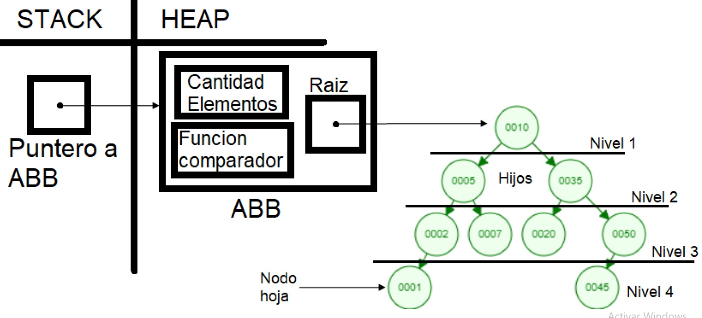

# TDA ABB

## Repositorio de Matias Ferrero - 109886 - mferreroc@fi.uba.ar

- Para compilar y correr pruebas locales con makefile:

```
make
```

- Para compilar y correr ejemplo con makefile:

```
make valgrind-ejemplo
```

- Para compilar y correr pruebas de la catedra con makefile:

```
make valgrind-chanutron
```
---
##  Funcionamiento

    Este programa implementa el TDA árbol binario de búsqueda, o ABB, con su iterador interno, mediante el uso 
    de nodos, otro TDA. El programa recibe los datos necesarios que entrega el usuario (elementos, posiciones, 
    funciones, etc.), y realiza las operaciones válidas del TDA. Particularmente, recibe una función comparador 
    con la que trabaja el ABB (insertar, buscar, etc), que devuelve <0, 0, o >0, si los elementos que se 
    comparan son el primero menor al segundo, iguales, o el primero mayor al segundo respectivamente.


## Respuestas a las preguntas teóricas
-   Qué es una árbol, árbol binario y árbol binario de búsqueda, cómo funcionan,
    cuáles son sus operaciones básicas, y cuál es el análisis de complejidad
    de cada una de ellas.
    
    Un árbol es un TDA que almacena nodos, cada uno con su correspondiente elemento o información guardada, 
    pero se ordenan de forma diferente que otros TDA ‘s como las listas o las colas.
    Los árboles cuentan con un nodo principal llamado raíz, por el cual podemos acceder al árbol. Ningún nodo 
    puede apuntar a la raíz del árbol, ya que es el nodo inicial del TDA, pero todos los demás nodos 
    pertenecientes al árbol cuentan con un solo nodo “superior” que apunta a ellos, llamado padre. Y a su vez, 
    cada nodo padre (incluyendo la raíz) puede estar conectado a otros múltiples nodos “inferiores”, llamados 
    nodos hijos. Cabe destacar que a un nodo sin hijos se lo llama nodo hoja, y si un nodo tiene hijos, cada 
    uno de ellos funciona como raíz de un subárbol, todos incluidos dentro del árbol principal. Posicionando 
    los nodos de esta manera, se obtiene una jerarquización de los nodos debido a que se generan niveles dentro 
    del árbol. Todos los hijos de un nodo están en un nivel inferior al de su padre, siendo la raíz el único 
    nodo en el primer nivel. Esto permite optimizar la búsqueda lineal de la lista (la complejidad algorítmica 
    de buscar en una lista es O(n) analizada con Big O).
    Hay distintos tipos de árboles, pero a los generales se los llama árboles N-Arios, siendo N el número 
    máximo de hijos que puede tener un padre dentro de ese árbol. Dentro de los N-Arios, se encuentran los 
    árboles binarios donde N es 2, o sea, cada nodo tiene como máximo 2 hijos y unicamente dos subárboles 
    (nodo/ subárbol izquierdo y derecho).
    A su vez, dentro de los árboles binarios, existen los árboles binarios de búsqueda o ABB. La diferencia 
    entre ambos, es que los elementos se insertan de forma ordenada en base a sus claves o alguna forma que 
    permita compararlos. De esta forma, las claves menores se insertan a la izquierda, las mayores se insertan 
    a la derecha, y en caso de que las claves sean iguales, se adopta una convención conveniente a la hora de 
    implementar el ABB. Además, debido al orden a la hora de insertar, la búsqueda de los elementos se vuelve 
    una búsqueda binaria cuya complejidad algorítmica es O(log(n)), analizada con Big O (siendo ésta menor que 
    O(n)).

    <div align="center">
    
    </div>

    Dentro de las operaciones (las cuales analizo con Big O) de los ABB están:
        -Crear: Se asigna memoria dinámica para guardar el ABB con una función para comparar elementos, por lo 
        que la complejidad es O(1).
        -Insertar: Se asigna memoria al nodo que guarda el elemento y se inserta según la clave, por lo que se 
        evita recorrer todo el ABB, ya que cada vez que se compara al elemento a insertar con el elemento ya 
        insertado, el problema se va reduciendo a la mitad, por lo tanto la complejidad es O(log(n)).
        -Buscar: Al igual que en la operación anterior, el problema se divide a la mitad cada vez que se 
        compara el elemento a buscar con el elemento actual, debido a que los elementos ya están ordenados, por 
        lo que la complejidad es O(log(n)).
        -Quitar: Se busca el elemento a quitar, y hay tres casos posibles; si el nodo no tiene hijos 
        simplemente se borra, si tiene un hijo el nodo se borra y su padre ahora apunta a su único hijo, y si 
        tiene ambos hijos el nodo se borra y se reemplaza por su predecesor inorden (el primer predecesor con 
        los elementos ordenados ascendentemente). Aunque haya tres casos posibles, para todos la complejidad es 
        la misma que la de buscar un elemento, o sea, O(log(n)).
        -Tamaño del ABB: Devuelve el tamaño del ABB, una operación O(1) si el TDA cuenta con una variable que 
        guarda la cantidad de nodos que hay en el ABB.
        -ABB vacío: Pregunta si el ABB tiene elementos, y devuelve true o false si está vacío, una operación 
        O(1).
        -Iterador interno: El iterador recorre el ABB con una de tres formas posibles, y a cada nodo le aplica 
        una función que le otorga el usuario. Como el iterador recorre todos los nodos (sin importar el 
        recorrido que se utilice), la complejidad algorítmica es O(n), pero esto depende de la complejidad de 
        la función que se reciba.
        -Recorrer: Se recorre todo el ABB con el iterador interno, y los elementos guardados en el árbol se 
        almacenan en un vector según el orden del recorrido utilizado, y cómo se utiliza el iterador interno 
        para recorrer, la complejidad también es O(n) ya que rellenar el vector tiene complejidad O(1).
        -Destruir: Como el ABB está implementado con nodos enlazados, en el peor de los casos hay que destruir 
        todos los nodos insertados antes de destruir el ABB (una operación que por sí sola es O(1), ya que solo 
        hay que usar la función free), y como tengo que recorrer todos los nodos para destruirlos, la 
        complejidad es O(n).
    Existe una posibilidad de que el ABB se degenere en una lista, si se insertan los elementos ascendente o 
    descendentemente. En este caso, las operaciones de insertar, buscar y quitar pasarían a tener una 
    complejidad O(n), ya que en el peor de los casos, para las tres operaciones se necesitaría recorrer todos 
    los nodos.

-   Explique su implementación y decisiones de diseño
    Para implementar el ABB, es necesario tomar algunas convenciones particulares de cada implementación. 
    Para empezar, la estructura de nuestro ABB además de tener al nodo raíz, tiene una variable que guarda la 
    cantidad de elementos que hay en el árbol, y la función comparador con la que trabaja el ABB. Por otro 
    lado, la estructura del nodo ahora tiene dos punteros, uno a su hijo izquierdo y otro al hijo derecho. 
    Aprovechando la estructura recursiva de los nodos, todas las operaciones están implementadas de forma 
    recursiva, excepto por:
        -Crear (no lo necesita)
        -ABB vacío (no lo necesita)
        -Tamaño (no lo necesita)
    En este caso, el ABB acepta elementos repetidos, y a la hora de insertar si la comparación de elementos da 
    igual, se inserta en el subárbol izquierdo.

    ```c
    if (comparacion <= PUNTO_COMPARACION)
            nodo_actual->izquierda = insertar_nodo(arbol, nodo_a_insertar,
                                nodo_actual->izquierda);
        else
            nodo_actual->derecha = insertar_nodo(arbol, nodo_a_insertar,
                                nodo_actual->derecha);
    ```

    Además, como ya se explicó anteriormente en la operación quitar, si el nodo a quitar tiene 2 hijos, se 
    reemplazará con el predecesor inorden.

    ```c
    if (nodo->derecha != NULL && nodo->izquierda != NULL) {
                void *predecesor_inorden = NULL;
                nodo->izquierda = extraer_predecesor_inorden(
                    nodo->izquierda, &predecesor_inorden);
                nodo->elemento = predecesor_inorden;
                return nodo;
    }
    ```

    Por último, como también ya se explicó en la operación recorrer, esta función reutiliza el iterador interno 
    para llenar el vector.

    ```c
    struct vector_recorrer_abb vector;
        vector.vec = array;
        vector.tope = tamanio_array;
        vector.cantidad = 0;
        return abb_con_cada_elemento(arbol, recorrido, rellenar_vector,
                        &vector);
    ```